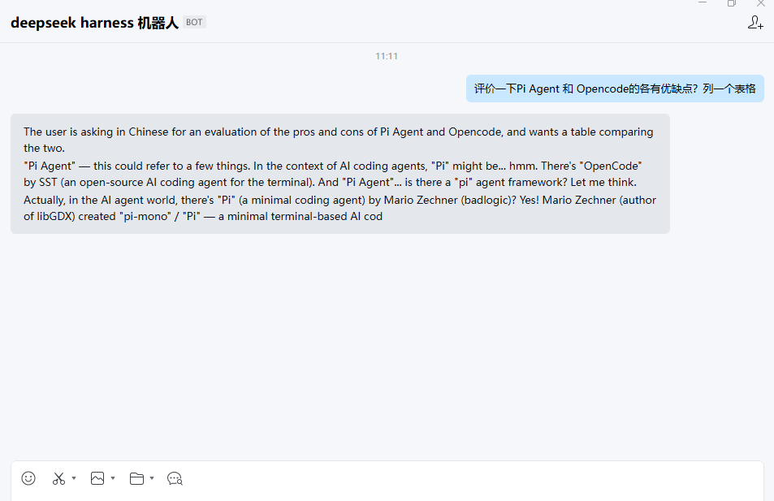
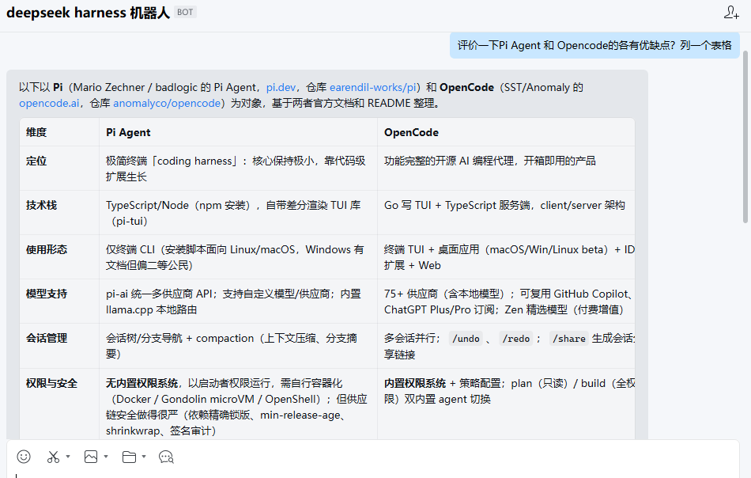

# dsh-wecom

DeepSeek Harness（dsh）企业微信智能机器人插件。通过企微"智能机器人"API 模式下的**长连接**（WebSocket）接入，将 WeCom 消息对接到 DSH Agent。



## 功能

| 模块 | 里程碑 | 状态 |
| --- | --- | --- |
| 长连接 | M1：WebSocket 订阅 + 心跳 + 指数退避重连 | 已实现 |
| 文本闭环 | M2：文本消息 → Agent → markdown / stream 回复 | 已实现 |
| 幂等去重 | M3：msgid LRU 去重 + 会话串行队列 | 已实现 |
| 多媒体 | M4：图片/文件/语音下载到沙箱 + 临时素材上传 | 已实现 |
| 事件 | M5：进入会话欢迎语 + 点赞/点踩审计日志 | 已实现 |
| 配置面板 | M6：浏览器端「⚙ 企微」面板，`connection.fetch` 精确路由读写设置 | 已实现 |

### 回复模式

- **markdown**：过程中不刷新，Agent 回合结束后一次性给出最终内容。
- **stream**：逐 token 推送到企微流式打字机（内置 500ms 推送节流）。

> 💡 **流式会同时转发「思考过程」与「答案」**。推理模型（R1 / thinking）的流式几乎全是
> `reasoning-delta`（思考 token），若只转发 `text-delta` 会出现「等全部思考完才输出」、长思考还
> 会打满企微 10 分钟流式上限。本项目两种增量都实时流式；进入答案阶段（`text-delta`）后自动丢弃思考
> 文本，企微里最终只展示干净答案。无增量到达的长空窗（思考初期 / 工具调用）另有 4s 保活心跳。

> ⚠ **两种模式都先发一帧流式占位（"思考中…"）**：企微要求「收到消息回调后 5 秒内回复」，
> 而 Agent 首个 token 通常远晚于此，不占位则 req_id 超时失效、后续所有帧被丢弃
> （用户侧一直停在 "…"）。占位帧与后续刷新共用同一个 `stream.id`，最终被 `finish=true`
> 的全量内容**原位替换**，聊天记录里只留一条消息。
> 从首帧起 10 分钟内必须 `finish=true`，插件在 5 分钟时主动收尾。

## 安装

```bash
# 确保在 dsh host 的工作目录中
# 将插件目录链接进目标 profile
npx @deepseek-ai/dsh plugin --profile web add /path/to/dsh-plugin-wecom
```

安装后重启 host（修改源码后同样需要重启 host 才能生效）。

## 快速启动（控制台配置）

安装后，打开 DSH 控制台 → 插件 → wecom → 配置：

1. **botId**：企微智能机器人 Bot ID（API 模式 → 长连接页面获取）。
2. **secret**：Bot Secret（仅创建时显示一次，`role('secret')` 脱敏存储）。
3. **preset**：Agent 使用的 DSH preset 名称（默认 `standard`）。
4. **replyMode**：`markdown` 或 `stream`（默认 `stream`）。

另外，浏览器端会挂一个「⚙ 企微」入口（侧边栏 footer，缺失时回退为浮动按钮），
可在页面内直接读写上述配置，无需重启 host。

### 配置面板的 RPC 通道（harness 0.1.5+）

宿主端通过 `connection.fetch.register()` 注册两条 **exact** 路由：

| 路径 | 方法 | 作用 |
| --- | --- | --- |
| `/api/wecom-rpc/get` | POST | 读取当前配置（`secret` 回传 `***` 占位） |
| `/api/wecom-rpc/update` | POST | 写入配置补丁（patch 语义，未提供的字段保持原值） |

> ⚠ **不要用 `connection.rpc.handle()`**：0.1.5 起它在内部访问 `owner.webServer`，
> 而 connection 插件的 fiber 不再 inject `webServer`，cordis 4 会抛
> `cannot get property "webServer" without inject`；错误被 connection 吞掉，
> host 无日志，浏览器只表现为 `transport failure ... HTTP 405`。

## 配置字段

| 字段 | 类型 | 默认 | 说明 |
| --- | --- | --- | --- |
| `botId` | `string` | — | 企微机器人 Bot ID（必填） |
| `secret` | `string` | — | Bot Secret（必填，`role('secret')` 脱敏） |
| `preset` | `string` | `'standard'` | DSH preset 名称 |
| `replyMode` | `'markdown' | 'stream'` | `'stream'` | 回复模式 |
| `sessionTtlMs` | `number` | `1800000` | 会话空闲超时（毫秒，最小值 60000） |
| `welcomeText` | `string` | — | 进入会话欢迎语（markdown），留空使用默认文案 |

## 验证清单

### M1：长连接跑通

- 日志依次出现 `connecting to wss://...` → `ws opened, sending aibot_subscribe` → `subscribed ok`
- 私聊机器人发"你好"，日志出现 message 事件
- 断网 10 秒恢复：日志 `heartbeat timeout, force reconnect` → 重连 → `subscribed ok`
- 起第二个实例：第一个实例收到 close 并警告（互踢验证）

### M2：最小闭环

- 文本消息 → Agent → markdown 回复正常
- stream 模式打字机效果正常，finish 帧正确结束
- 群聊消息 `@机器人` 前缀被正确去除

### M3：幂等 + 串行

- 断网重连后同一条消息重推：只处理一次，不重复回复
- 快速连发 3 条消息：回复顺序严格 = 发送顺序，无交叉
- 不同会话（两个人）并发发消息：互不阻塞

### M4：多媒体

- 发送图片：沙箱目录出现 `.png` 文件，Agent 收到路径
- 发送文件/语音：同上，扩展名正确
- Agent 工具产出文件：用户收到文件消息，文件名正确
- 媒体下载失败：用户收到友好错误提示

### M5：事件

- 首次打开机器人对话：自动收到欢迎语（自定义 `welcomeText` 生效）
- 点击消息 👍/👎：日志打印 `feedback event`

## 架构

```
企微长连接（wss） ←→ WsClient（ws.ts）
                         ↓ message / event
                   SessionBridge（bridge.ts）
                    ↙         ↓         ↘
              LRU 去重    会话队列     Agent 桥接
              (lru.ts)   (queue.ts)   (ctx.agents)
                                        ↓
                          DSH Agent（事件驱动回复）
                                        ↓
                    agent/assistant-stream → 流式推送（reasoning-delta + text-delta），仅转发、不收尾
                    session/event → assistant/message（干净终稿）+ turn/end（★唯一收尾信号★）
```

- **WsClient**：企微长连接协议实现（订阅/心跳/重连/回复方法），与 DSH 解耦。
- **SessionBridge**：消息分发、白名单校验、幂等去重、会话串行队列、Agent 调用协调。
- **MediaHandler**：沙箱内媒体文件下载/上传（使用 Node 原生 `fetch` + `FormData`）。
- **Agent 桥接**：每个企微会话对应一个 DSH agent session，`followup` 发消息 → 实时增量来自 `agent/assistant-stream`（`frame.chunk.type` 为 `reasoning-delta` / `text-delta`），干净终稿与错误来自 `session/event`（`assistant/message` / `turn/end`）。**注意 `session/event` 不携带增量 chunk**；**收尾只认 `turn/end`**——`agent/assistant-stream` 的 `end` 帧每次 attempt 都发（多工具循环里中间那次只调了工具、尚无文本答案），用它收尾会提前切断并丢掉最终答案。

## 常见问题

### `处理失败：session "wecom:single:xxx" already exists`

session store 的 id 在同一进程内唯一，`sessions.prepare()` 撞上同名会话就会抛错。常见诱因是
上一轮 bridge 的 agent 还没释放完（`AgentHandle.dispose()` 是异步的）就建了新 bridge
（配置热更新 / 插件重载），或进程内已存在该会话的 agent。

插件按以下顺序自愈，不会再把这个错误抛给用户：

1. 本 bridge 已缓存 → 直接复用；
2. `ctx.agents.get(sid)` 有存活 agent → **借用**（不重复 create，也不在释放时销毁它）；
3. `create` 报冲突 → 再借一次（并发刚落地）；
4. 仍冲突 → **同 id 重试一次**（瞬时竞争，事务回滚后 store 已空）；
5. 仍失败 → 用 `原id#时间戳` 开新会话并告警（SessionStore 没有公开删除接口，残留会话只能绕开）；
6. 服务重启走串行 promise 链，先 `await` 旧 bridge 的 `dispose()` 再建新实例。

### 企微侧一直是 "…" 没有回复

先看 Web 控制台（`:3080`）里该会话有没有产出——有产出说明 Agent 正常，问题在回复时序：
企微要求**收到回调后 5 秒内**回一帧，本插件在 `process()` 一开始就发流式占位帧来满足它，
所有出口（成功 / 失败 / 超时）统一用 `finish=true` 收尾。
若仍无回复，查 host 日志里的 `raw frame:` 行——企微对失效/错误帧会回带 `errcode`。

日志关键词：

- `adopt live agent for ...` —— 走了借用分支；
- `create session ... 冲突（...）；诊断: agent=... session=... sessions服务=... 存活会话=N` —— 走了自愈分支，括号里是定位信息；
- `... 仍冲突（...），改用新会话 ...` —— 最终兜底，会话上下文会重置。

## License

Apache License 2.0